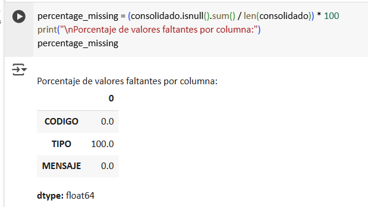
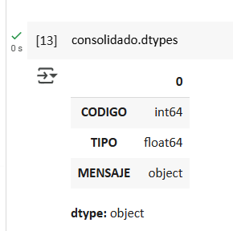
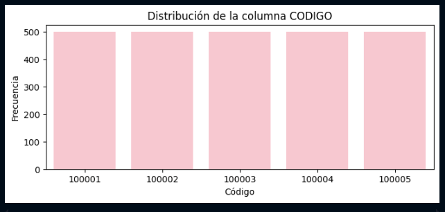
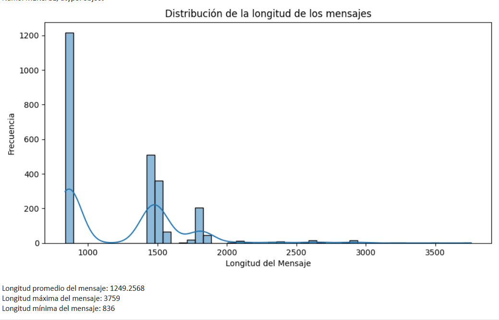

# Reporte de Datos
 

## Resumen general de los datos

El conjunto de datos consolidado se obtiene a partir de cinco archivos JSON distintos, alojados en un bucket de AWS S3. El DataFrame resultante, una vez cargado, contiene un total de **[Número de observaciones]** filas y 4 columnas (variables): `CODIGO`, `TIPO`, `MENSAJE`.

Las variables incluyen una mezcla de tipos de datos, como se detalla en el diccionario de datos:
- **Categóricas:** `CODIGO`, `TIPO`
- **Textuales:** `MENSAJE`

La variable `CODIGO` es la variable objetivo que se busca predecidir. Un primer paso en el análisis será realizar un conteo exacto de las observaciones, verificar la presencia y distribución de valores faltantes (nulos) en cada una de las columnas, y obtener estadísticas descriptivas básicas para entender la distribución inicial de los datos.

*[Nota: El número de observaciones se completará una vez se ejecute el script de carga y se realice el primer análisis exploratorio.]*

## Resumen de calidad de los datos

El análisis inicial de la calidad de los datos se centrará en identificar y cuantificar posibles problemas que podrían afectar el rendimiento del modelo de clasificación. El plan de acción se detalla a continuación:

-   **Valores Faltantes (Nulos):**

El análisis de valores nulos, ilustrado en la imagen anterior, demuestra que la columna `TIPO` carece completamente de datos (100% de valores faltantes).

 **Acción:** Se eliminará la columna `TIPO` del DataFrame, ya que no aporta ningún valor predictivo al modelo y no puede ser utilizada en el entrenamiento.

-   **Consistencia de Tipos de Datos:**

Evaluando a detalle la información suministrada, se evidencia que el campo MENSAJE es de tipo string que contiene un objeto json con el mensaje que genera la etiqueta

## Variable objetivo

La variable `CODIGO` es la variable objetivo que se busca predecir. Un primer paso en el análisis será realizar un conteo exacto de las observaciones, verificar la presencia y distribución de valores faltantes (nulos) en cada una de las columnas, y obtener estadísticas descriptivas básicas para entender la distribución inicial de los datos.

## Variables individuales

A continuación, se detalla el plan de análisis para cada variable relevante del conjunto de datos.

### `CODIGO` (Variable Objetivo)

- **Análisis Descriptivo:**  

-  La imagen anterior muestra la distribución de frecuencias para la variable objetivo `CODIGO`. Se observa un excelente balance de clases, ya que todas las categorías tienen una representación muy similar en el conjunto de datos. Esta uniformidad es altamente beneficiosa para el entrenamiento del modelo, ya que reduce el riesgo de que el algoritmo se sesgue hacia las clases mayoritarias y facilita la obtención de un rendimiento robusto y generalizable para todas las categorías.

### `TIPO` (Variable Categórica)
- Sobre la variable TIPO Se hace la eliminación de la misma por no contener información relacionada

### `MENSAJE` (Variable Textual)

- **Análisis Descriptivo:** La variable `MENSAJE` es la característica principal y el único insumo para el modelo de clasificación. Contiene el texto descriptivo de cada transacción.
    -   **Estructura del Contenido:** Como se observó en el análisis de calidad de datos, cada `MENSAJE` es una cadena de texto (string) que a su vez contiene un objeto JSON. Para el modelado, será necesario extraer el texto relevante de esta estructura.
    -   **Análisis de Longitud:** El histograma (imagen anterior) muestra la distribución de la longitud (en número de caracteres) de los mensajes. Se observa una variabilidad considerable, con una longitud máxima de 3,759 caracteres y una moda (longitud más frecuente) alrededor de 836 caracteres. Esta distribución es importante para la configuración del modelo Transformer, ya que nos ayuda a definir la longitud máxima de secuencia (`max_length`) a utilizar durante la tokenización, buscando un equilibrio entre capturar la mayor cantidad de información y la eficiencia computacional.

## Ranking de variables

Dado que la variable explicativa principal es `MENSAJE` (texto), y se utilizará un modelo de **Transformadores (Transformers)**, las técnicas de ranking se centrarán en la interpretabilidad del modelo para entender las predicciones a nivel de instancia. El plan es el siguiente:

1.  **Preprocesamiento:**
    -   La variable `MENSAJE` se procesará utilizando un **tokenizador** específico para el modelo Transformer elegido (ej. `AutoTokenizer` de la librería Hugging Face). Este proceso convierte el texto en los formatos requeridos por el modelo, como `input_ids` y `attention_mask`.

## Relación entre variables explicativas y variable objetivo

El análisis de la relación entre las variables se enfoca en cómo las características influyen en la predicción de la variable objetivo `CODIGO`.

-   **Relación `MENSAJE` vs `CODIGO`:** Se analizará a través de las técnicas de interpretabilidad del modelo Transformer. Se examinarán ejemplos representativos de cada clase de `CODIGO` para identificar los patrones textuales (palabras, frases) que el modelo aprendió a asociar con cada categoría.
