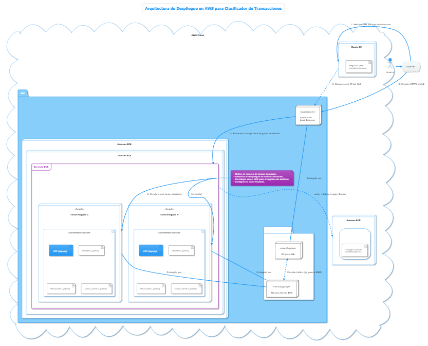

# Despliegue de modelos

## Infraestructura
 
- **Nombre del modelo:** Clasificador de Transacciones
- **Plataforma de despliegue:** Amazon Web Services (AWS) - Amazon ECS (Elastic Container Service)
- **Requisitos técnicos:** 
    - Python 3.9 o superior.
    - Bibliotecas: scikit-learn, pandas, numpy, Flask/FastAPI (para el endpoint de API).
    - Hardware: Tarea de Fargate con 2 vCPU y 4 GB de RAM.
- **Requisitos de seguridad:** 
    - Autenticación mediante claves de API o tokens OAuth 2.0 para el acceso al endpoint.
    - Uso de roles y permisos de AWS IAM (Identity and Access Management) para restringir el acceso a los recursos de la nube.
    - Gestión de secretos (secrets management) para credenciales y claves de API.
- **Diagrama de arquitectura:**




## Código de despliegue

- **Archivo principal:** `app.py` (Contiene la API de Flask/FastAPI para servir el modelo).
- **Rutas de acceso a los archivos:**
    - `app.py`: El script de la aplicación web.
    - `models/model.joblib`: El modelo entrenado y serializado.
    - `requirements.txt`: Lista de dependencias de Python.
    - `Dockerfile`: Archivo para construir la imagen del contenedor para Cloud Run.
- **Variables de entorno:**
    - `MODEL_PATH`: Ruta al archivo del modelo (ej. `models/model.joblib`).
    - `PORT`: Puerto en el que se ejecutará la aplicación (usualmente gestionado por Cloud Run, por defecto 8080).

## Documentación del despliegue

- **Instrucciones de instalación:**
    1.  **Prerrequisitos:**
        - Instalar y configurar [AWS CLI](https://aws.amazon.com/cli/).
        - Instalar [Docker](https://docs.docker.com/get-docker/).
    2.  **Autenticación:**
        - Configurar las credenciales de AWS: `aws configure` (necesitarás un Access Key ID y un Secret Access Key).
    3.  **Construir y Subir la Imagen del Contenedor a ECR (Elastic Container Registry):**
        - Crear un repositorio en ECR (si no existe): `aws ecr create-repository --repository-name clasificador-proyectos --region [REGION]`
        - Autenticar Docker con el registro de ECR: `aws ecr get-login-password --region [REGION] | docker login --username AWS --password-stdin [AWS_ACCOUNT_ID].dkr.ecr.[REGION].amazonaws.com`
        - Construir la imagen de Docker: `docker build -t clasificador-proyectos .`
        - Etiquetar la imagen para ECR: `docker tag clasificador-proyectos:latest [AWS_ACCOUNT_ID].dkr.ecr.[REGION].amazonaws.com/clasificador-proyectos:v1`
        - Subir la imagen al repositorio de ECR: `docker push [AWS_ACCOUNT_ID].dkr.ecr.[REGION].amazonaws.com/clasificador-proyectos:v1`
    4.  **Desplegar en Amazon ECS (con Fargate):**
        - **Paso 1: Crear un Cluster de ECS.**
        - **Paso 2: Crear una Definición de Tarea (Task Definition).**
        - **Paso 3: Registrar la Definición de Tarea.**
        - **Paso 4: Crear un Servicio.**
          - La forma más sencilla es usar la **Consola de AWS** para crear un nuevo servicio dentro del cluster, seleccionando la definición de tarea creada y configurando la red (VPC, subredes) y un balanceador de carga si es necesario.

- **Instrucciones de configuración:**
    - Las variables de entorno se configuran en el archivo `task-definition.json`.
    - Ejemplo: `"environment": [{ "name": "MODEL_PATH", "value": "models/model.joblib" }]`
    - Los recursos (CPU, memoria) también se definen en la definición de tarea.

- **Instrucciones de uso:**
    - Una vez desplegado, el servicio tendrá una URL de endpoint.
    - Para realizar una predicción, se debe enviar una petición POST a la ruta `/classify` con un cuerpo JSON que contenga los datos del proyecto.
    - Ejemplo usando `curl`:
      ```bash
    curl --location 'http://lb-proy-VPN-1189497738.us-east-2.elb.amazonaws.com/classify/' \
 --header 'Content-Type: application/json' \
 --data '{ "text": ""}'
      ```

- **Instrucciones de mantenimiento:**
    - **Actualización del modelo:** Para desplegar una nueva versión, construye y sube una nueva imagen de Docker a ECR con una nueva etiqueta (ej. `v2`). Luego, crea una nueva revisión de la Definición de Tarea apuntando a la nueva imagen y actualiza el servicio de ECS para que la utilice. ECS gestionará el despliegue sin tiempo de inactividad.
    - **Monitoreo y Logs:** Utilizar **Amazon CloudWatch** para visualizar los logs de los contenedores, monitorear métricas como el uso de CPU y memoria, y configurar alarmas.
    - **Escalado:** El escalado automático se configura en el servicio de ECS, permitiendo ajustar el número de tareas (contenedores) en función de métricas como el uso de CPU o el número de peticiones.
