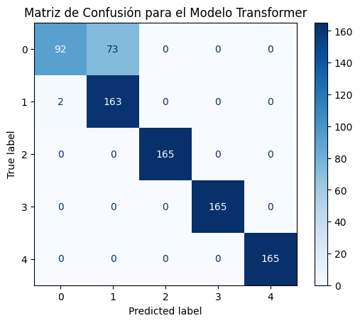

# Reporte del Modelo Baseline

Este documento presenta la construcción, evaluación y análisis del modelo baseline, que sirve como punto de referencia fundamental para el desarrollo de modelos más avanzados en este proyecto. El objetivo de este modelo inicial es establecer un rendimiento base con un enfoque simple y rápido de implementar.

## 1. Descripción del Modelo

El modelo baseline es el primer prototipo funcional construido. Su propósito principal es validar el pipeline de modelado de extremo a extremo y proporcionar una métrica de comparación inicial contra la cual se medirán todos los modelos futuros.

-   **Algoritmo Seleccionado:** Se utilizó `Transformer`.
-   **Justificación de la Elección:** Este algoritmo fue seleccionado por su simplicidad, interpretabilidad y rapidez de entrenamiento, características ideales para un primer modelo de referencia.

## 2. Datos Utilizados

A continuación, se detallan las características de los datos empleados para el entrenamiento y evaluación del modelo.

### Características de Entrada

El modelo fue entrenado utilizando un objeto JSON con información de movimientos bancarios.

### Característica Objetivo

La variable a predecir es:

-   **Nombre:** CODIGO
-   **Descripción:** Cada código representa una cuenta contable

## 3. Evaluación del Modelo

### Metodología de Evaluación

Para evaluar el rendimiento del modelo, se utilizó un esquema de **división de datos (train-test split)**. El conjunto de datos se dividió de la siguiente manera:
-   **Conjunto de Entrenamiento:** `70%` de los datos.
-   **Conjunto de Prueba:** `30%` de los datos.

### Métricas de Evaluación

Se seleccionaron las siguientes métricas para evaluar el rendimiento del modelo, dada la naturaleza del problema de clasificación:

-   **Accuracy:** Proporción de predicciones correctas.
-   **Precision:** De todas las predicciones positivas, cuántas fueron correctas. Relevante para minimizar falsos positivos.
-   **Recall (Sensibilidad):** De todos los casos positivos reales, cuántos fueron identificados correctamente. Relevante para minimizar falsos negativos.
-   **F1-Score:** Media armónica de Precision y Recall. Útil para clases desbalanceadas.
 

### Resultados de Evaluación

Los resultados del modelo en el conjunto de prueba se deben resumir en la siguiente tabla:

| Métrica      | Valor         |
|--------------|---------------|
| Accuracy     | 0.909091      |
| Precision    | macro avg: 0.933880, weighted avg: 0.933880     |
| Recall       | macro avg: 0.909091, weighted avg: 0.909091     |
| F1-Score     | macro avg: 0.904678, weighted avg: 0.904678     |

A continuación, se muestra la **matriz de confusión** para visualizar el desempeño del modelo en detalle:

## 4. Análisis de los Resultados

El modelo baseline Transformer obtuvo un accuracy general de 0.909, lo que indica un buen rendimiento en la clasificación de movimientos bancarios.

-   **Fortalezas:** El modelo presenta un alto rendimiento en las clases 2, 3 y 4, logrando una precisión, recall y F1-score de 1.0. Esto sugiere que el modelo identifica correctamente los movimientos bancarios correspondientes a estas clases. Además, para la clase 1, el modelo muestra un recall muy alto (0.987879), indicando una buena capacidad para identificar la mayoría de los casos positivos de esta clase, aunque con una precisión menor (0.690678).

-   **Debilidades:** La principal debilidad del modelo se encuentra en la clase 0, donde el recall es relativamente bajo (0.557576) a pesar de tener una precisión alta (0.978723). Esto implica que el modelo tiene dificultades para identificar todos los movimientos bancarios que pertenecen a esta clase, generando falsos negativos.

Este análisis inicial sugiere que los futuros modelos deberían centrarse en mejorar la identificación de movimientos bancarios de la clase 0 (aumentar el recall), sin comprometer la alta precisión ya lograda en esta y otras clases.  También sería útil investigar por qué el modelo distingue tan bien las clases 2, 3 y 4, para aplicar esos aprendizajes a la clase 0.

 
## 5. Conclusiones

- El modelo baseline ha cumplido su objetivo al establecer una referencia de rendimiento, alcanzando una precisión (accuracy) de `0.909`. Proporciona una base sólida para la comparación y demuestra la viabilidad del pipeline de datos, a pesar de algunas limitaciones en el poder predictivo en todas las clases.

El modelo demuestra fortaleza en la clasificación de las clases 2, 3 y 4 con una precisión y recall perfectos, pero exhibe debilidad en la clase 0, donde el recall es significativamente menor que la precisión, lo que indica un desafío en la identificación de todas las instancias de esta clase. Las iteraciones futuras deberían centrarse en abordar este desequilibrio. El F1-Score es superior para la clase 1 e inferior para la clase 0

## 6. Referencias

